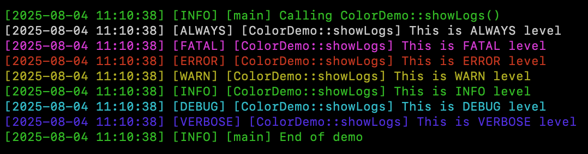

# Colorful C++ Logger


A lightweight, header-only, thread-safe, colorful C++ logger with custom sinks and color-coded output. Designed for C++11 and above, it works seamlessly with GCC, Clang, and MSVC.

## Features

- Header-only library (single include)
- C++11 and higher support
- Thread-safe implementation
- Colored console output with customizable colors
- Multiple output sinks (console, file, custom)
- Logger settings stack (log level, filters, colors, sinks) for temporary overrides
- Automatic function and class name detection
- Formatted timestamps
- File output (colors stripped automatically)
- Lightweight and efficient

## Log Levels

Default log levels with their colors:
- `ALWAYS` (White)
- `FATAL` (Magenta)
- `ERROR` (Red)
- `WARN` (Yellow)
- `INFO` (Green)
- `DEBUG` (Cyan)
- `VERBOSE` (Blue)

## Build and Run

You can configure, build, run, format, and test everything using CMake targets:

| Action               | Command                                            |
|----------------------|----------------------------------------------------|
| Configure            | `cmake -S . -B build`                              |
| Build all examples   | `cmake --build build --target examples`            |
| Run all examples     | `cmake --build build --target run_all_samples`     |
| Format code          | `cmake --build build --target clang_format`        |
| Build unit tests     | `cmake --build build --target tests`               |
| Run unit tests       | `cmake --build build --target run_tests`           |

Alternatively, to run unit tests with full output:
```bash
./build/logger_tests --gtest_color=yes
```

## Basic Usage

```cpp
#include <cstdio>
#include "cppColorLogger/logger.h"

class ColorDemo {
public:
  void showLogs() {
    LOGGER_C(LOGLEVELL::ALWAYS, "This is ALWAYS level");
    LOGGER_C(LOGLEVELL::FATAL, "This is FATAL level");
    LOGGER_C(LOGLEVELL::ERROR, "This is ERROR level");
    LOGGER_C(LOGLEVELL::WARN, "This is WARN level");
    LOGGER_C(LOGLEVELL::INFO, "This is INFO level");
    LOGGER_C(LOGLEVELL::DEBUG, "This is DEBUG level");
    LOGGER_C(LOGLEVELL::VERBOSE, "This is VERBOSE level");
  }
};

int main() {
  LOGGER.setLogLevel(LOGLEVELL::VERBOSE);

  LOGGER_F(LOGLEVELL::INFO, "Calling ColorDemo::showLogs()");
  ColorDemo demo;
  demo.showLogs();

  LOGGER_F(LOGLEVELL::INFO, "End of demo");
  return 0;
}
```

Expected Output:




## Advanced Features

### In-Memory Logging

```cpp
LOGGER.enableInMemorySink();
LOGGER.setLogLevel(LOGLEVELL::INFO);
LOGGER_F(LOGLEVELL::INFO, "Captured to memory");

for (const auto& log : LOGGER.getInMemoryLogs()) {
    std::cout << "[MEM] " << log << std::endl;
}
```

### Filter Specific Levels

```cpp
LOGGER.setLogLevel(LOGLEVELL::DEBUG);
LOGGER.setFilterLevels({ LOGLEVELL::ERROR, LOGLEVELL::WARN });

LOGGER_F(LOGLEVELL::DEBUG, "Filtered out");
LOGGER_F(LOGLEVELL::ERROR, "Allowed");
```

### Color Customization

```cpp
LOGGER.setLevelColor(LOGLEVELL::INFO, Color::CYAN);
LOGGER_F(LOGLEVELL::INFO, "This will be cyan in console");
```

### Scoped Logger Settings (Push/Pop)

```cpp
LOGGER.setLogLevel(LOGLEVELL::INFO);
LOGGER_F(LOGLEVELL::DEBUG, "This won't show");

LOGGER.pushLogSetting();
LOGGER.setLogLevel(LOGLEVELL::DEBUG);
LOGGER_F(LOGLEVELL::DEBUG, "This debug will show");
LOGGER.popLogSetting();

LOGGER_F(LOGLEVELL::DEBUG, "Debug again filtered out");
```

### File Logging

```cpp
LOGGER.setFileOutput("output.log");
LOGGER.setLogLevel(LOGLEVELL::INFO);
LOGGER_F(LOGLEVELL::INFO, "This is written to the file");
```

## Integration

### Method 1: Direct Include
1. Copy the `include/cppColorLogger` directory to your project
2. Add the parent directory to your include path
3. Include the header: `#include "cppColorLogger/logger.h"`

### Method 2: CMake Subproject
1. Add this repository as a submodule or copy it to your project
2. Add the following to your CMakeLists.txt:
```cmake
add_subdirectory(CppColorLogger)
target_link_libraries(your_target PRIVATE cppColorLogger)
```
3. Include the header: `#include "cppColorLogger/logger.h"`
3. Initialize logger (optional, done automatically):
```cpp
auto& logger = LOGGER::getInstance();
logger.setLogLevel(LOGLEVELL::DEBUG);  // Optional: Set default level
```

## Using in Your CMake Project

Since this is a header-only library, you can simply add the include directory to your project:

```cmake
# In your CMakeLists.txt
include_directories(path/to/CppColorLogger/include)
```

Or, if you want to make it available system-wide:

```cmake
# Install headers
install(DIRECTORY include/cppColorLogger DESTINATION ${CMAKE_INSTALL_INCLUDEDIR})
```

## Thread Safety

All operations are thread-safe. The logger uses:
- Atomic operations for log levels
- Mutex protection for sinks and color maps
- Lock-free reading for performance

## License

This project is licensed under the MIT License - see the [LICENSE](LICENSE) file for details.